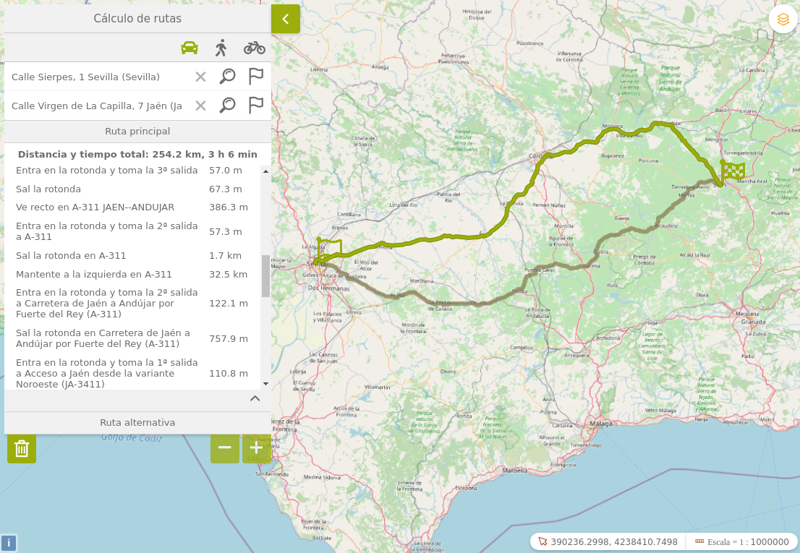

# findroute
Plugin búsqueda de rutas OSRM para Mapea desarrollado por el Servicio de Transformación Digital de la Secretaría General de Medio Ambiente, Agua y Cambio Climático como una funcionalidad incorporada al constructor de visores GRAMA.

Este plugin **precisa para desplegar toda su potencialidad de una infraestructura propia de Open Source Routing Machine (OSRM) 3** que se encarga de proporcionar los servicios de enrutamiento.

Como alternativa, bastaría con la utilización de los servicios en la nube de openstreetmap. La limitación de dichos servicios en la nube versa sobre la incapacidad de seleccionar tipos de locomoción en el cálculo de las rutas.




## Dependencias

- findroute.ol.min.js
- findroute.ol.min.css

## Parámetros

Findroute debe instanciarse mediante una configuración en la que se incluyen los siguientes parámetros:

- **osrmurl**: URL del servicio Open Source Routing Machine (OSRM) con el motor para el cálculo de
rutas. Opcional, en caso de no indicarlo, el plugin usará la URL del servicio de pruebas de OSRM.
- **osrmurlAlternativa**: URL del servicio de pruebas de OSRM. Obligatorio.
- **panel**: Posición del panel del plugin en el visor. Opcional, por defecto arriba a la izquierda.
- **conflictedPlugins**: Lista de plugins a desactivar al activar el mismo. Opcional.
- **urlGeocoderInverso**: URL del servicio de geocoder inverso del Callejero de Andalucia Unificado.

## Ejemplos de uso

```javascript
var mp = new Findroute({
  options: {
    // Especificar url de instancia de OSRM
    //osrmurl: "https://www.xxx.yyy",
    osrmurlAlternativa: "https://router.project-osrm.org",
    panel: {
      position: M.ui.position.TL
    },
    conflictedPlugins: ["navigation", "tools", "panelSelectByPolygon"],    
    urlGeocoderInverso: "http://ws248.juntadeandalucia.es/EXT_PUB_CallejeroREST/geocoderInversoSrs"
  }
});

// add here the plugin into the map
myMap.addPlugin(mp);
```
## Infraestructura OSRM
Como se ha mencionado anteriormente, la utilización de todos los tipos de medios de locomoción en el cálculo de rutas requiere de la instalación de OSRM en una infraestructura propia.

A continuación se describen los pasos para realizar dicha instalación mediante Docker.

**Requisitos**

- Disponer del producto Docker instalado en la máquina donde se pretende desplegar OSRM, con las imágenes osrm-backend (openstreetmap) y nginx . La descarga de una imagen, requiere ejecutar: 
```shell
docker pull NOMBRE_IMAGEN
```
- Disponer del archivo del tipo osm.pbf con los datos de Andalucía (en concreto: andalucia-latest.osm.pbf ) descargable desde la ruta de openstreetmap siguiente:
https://download.openstreetmap.fr/extracts/europe/spain/
- Se precisan la utilización de tres puertos y un mínimo de 2 Gbytes. Además para el nginx se precisará otro puerto más y unos 256 megabytes de memoria.

**Instalación**

1.- Levantar la imagen de docker osrm-backend descargada de openstreetmap:
```shell
$ docker run -dit -p PUERTO_HOST_1:5000 -v “RUTA_HOST:/data” -p PUERTO_HOST_2:5001 -p PUERTO_HOST_3:5002 --memory=”2048m” osrm/osrm-backend
```
2.- Una vez que Docker esté levantado y el archivo osm.pbf accesible desde dentro del contenedor, el siguiente paso implica colocar el citado archivo en tres carpetas distintas. Esto es preciso para disponer de los perfiles correspondientes a los modos de locomoción (coche, bicicleta y a pie) activos a la vez. Hay que tener la precaución de no colocarlos en la misma carpeta, puesto que se acabarían sobrescribiendo datos. Por ejemplo:
- /any/path/car/andalucia-latest.osm.pbf
- /any/path/foot/andalucia-latest.osm.pbf
- /any/path/bicycle/andalucia-latest.osm.pbf

3.- Una vez completado el paso anterior, se tendrán que ejecutar los siguientes comandos:
```shell
$ osrm-extract -p /opt/car.lua /any/path/car/andalucia-latest.osm.pbf
$ osrm-partition /any/path/car/andalucia-latest.osrm
$ osrm-customize /any/path/car/andalucia-latest.osrm
$ osrm-routed --port 5000 --algorithm mld /any/path/car/andalucia-latest.osrm
```
Con ello, se ha conseguido tener desplegado el servicio para rutas con coche en el puerto 5000 (cámbiese al puerto que se desee según las directrices de la infraestructura interna de la organización donde se ubique OSRM) dentro del contenedor y en la ruta PUERTO_HOST_1 en el host.

4.- Se repitirá el paso anterior para las rutas a pie y con bici.
```shell
$ osrm-extract -p /opt/foot.lua /any/path/foot/andalucia-latest.osm.pbf
$ osrm-partition /any/path/foot/andalucia-latest.osrm
$ osrm-customize /any/path/foot/andalucia-latest.osrm
$ osrm-routed --port 5001 --algorithm mld /any/path/foot/andalucia-latest.osrm
$ osrm-extract -p /opt/bicycle.lua /any/path/bicycle/andalucia-latest.osm.pbf
$ osrm-partition /any/path/bicycle/andalucia-latest.osrm
$ osrm-customize /any/path/bicycle/andalucia-latest.osrm
$ osrm-routed --port 5002 --algorithm mld /any/path/bicycle/andalucia-latest.osrm
```
En este momento ya se encuentran desplegados los servicios de enrutamiento en el
contenedor.

5.- Instalación de Nginx que actuará como proxy redirigiendo todas las peticiones en función son a pie, con coche o con bicicleta. Para levantar el contenedor, se ejecutará:
```shell
$ docker run -dit -p PUERTO_HOST:80 --memory=”256m” nginx
```
Una vez activo, se modificará el archivo de configuración del proxy. Este archivo se encuentra en /etc/nginx/nginx.conf. En este fichero, se incluirá lo siguiente dentro del http{}:
```shell
server {
listen 80 default_server; listen[::]:80 default_server ipv6only=on;
location /route/v1/driving {proxy_pass IP_HOST:PUERTO_HOST_1}
location /route/v1/walking {proxy_pass IP_HOST:PUERTO_HOST_2}
location /route/v1/cycling {proxy_pass IP_HOST:PUERTO_HOST_3}
location /nearest/v1/driving {proxy_pass IP_HOST:PUERTO_HOST_1}
location /nearest/v1/walking {proxy_pass IP_HOST:PUERTO_HOST_2}
location /nearest/v1/cycling {proxy_pass IP_HOST:PUERTO_HOST_3}
location / {
add_header Content-Type text/plain;
return 404 Your request is bad ;}
}
```
Una vez añadido, se reinicia el servicio con el comando:
```shell
$ nginx -s reload
```
Una vez completados los pasos anteriores, se dispone de un OSRM desplegado en la infraestructura local con lo que ya se puede proceder a realizar al servicio de enrutamiento.